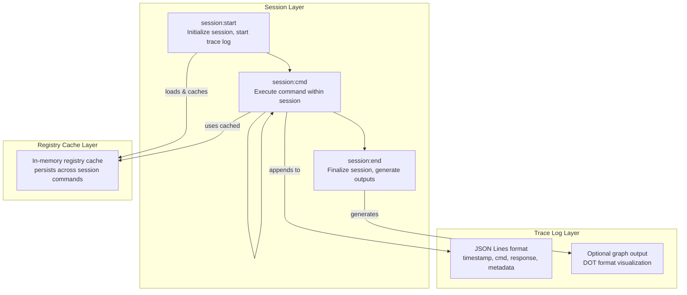

## Context

ASPIS (Agentic Specification Protocol for Introspective Systems) is a governance protocol that uses markdown-bound metadata to create machine-resolvable specifications. The current CLI (`tools/aspis.py`) operates in a stateless batch mode: each command parses the registry from markdown files and returns JSON output.

Current workflow:

```
$ aspis.py path:aspis.entry
{json blob}
$ aspis.py path:aspis.authority.surface.schema  
{json blob}
```

Each invocation re-parses the registry from markdown files. There is no session state, audit trail, or visibility into an agent's traversal path.

## Problem Statement

When agents crawl through ASPIS specifications to acquire context:

- **No visibility**: Humans cannot see in real-time how an agent is acquiring context
- **No audit trail**: No record of which clauses were resolved in sequence
- **No resumability**: Long crawls cannot be paused and resumed
- **Performance overhead**: Registry is re-parsed from markdown on every command
- **Debugging friction**: Understanding why an agent made certain decisions requires manual reconstruction

## Proposed Solution: Session-Based Tracing

Instead of a persistent interactive shell (which adds process management complexity), implement a session-based model where each session is a traceable, resumable context acquisition run.

### Architecture




## Implementation Plan

### 1. New Session Commands

Add three new **top-level** argv branches in `main()`, matching existing `init` / `lint` dispatch: first token is exactly `session:start`, `session:cmd`, or `session:end` (case-insensitive). All session commands accept the same workspace options as clause mode where applicable: `--config <path>`, `--design-docs-dir <path>`, `--governance-doc <path>` (parsed by shared helpers so the cached registry matches a non-session `aspis.py path:...` run with the same flags).


| Command         | Purpose                                                                                                                                                   | Flags / arguments                                                                                                                                                                                                                                    | Example                                                                                  |
| --------------- | --------------------------------------------------------------------------------------------------------------------------------------------------------- | ---------------------------------------------------------------------------------------------------------------------------------------------------------------------------------------------------------------------------------------------------- | ---------------------------------------------------------------------------------------- |
| `session:start` | Create session dir, optional trace file, load & cache registry, print session metadata JSON on stdout                                                     | `--name <string>` (required, human label; not necessarily equal to `session_id`), optional `--trace` (enable `trace.jsonl`; if omitted, session may still exist for cache-only use), plus workspace options above                                    | `python3 tools/aspis.py session:start --name crawl1 --config aspis.yaml`                 |
| `session:cmd`   | Resolve one or more clauses using the session registry cache                                                                                              | `--session <session_id>` (required), then the **same positional clause tokens** as today (`path:id`, `clause id ...`, etc.), plus workspace options (must match the session’s resolved docs root / governance doc or emit `SESSION_CONFIG_MISMATCH`) | `python3 tools/aspis.py session:cmd --session <id> path:aspis.entry`                     |
| `session:end`   | Finalize session; stdout is **always a JSON object** (`status`, `session_id`, and format-specific fields). Optional `.dot` file when format is `graphviz` | `--session <session_id>` (required), `--format` with value `summary`, `json`, or `graphviz` (default `summary`); for `graphviz`, require `--output <path>` for the DOT file                                                                          | `python3 tools/aspis.py session:end --session <id> --format graphviz --output trace.dot` |


**Stdout contract per subcommand**

- `session:start`: Single JSON object on stdout (session metadata). Exit 0 on success.
- `session:cmd`: **Identical stdout to current clause mode** (full `resolve_batch` JSON envelope). Tracing is a side effect: when `trace_enabled` is true in `session.json`, also append one line to `trace.jsonl`. Exit codes match clause mode (non-zero on blocking error).
- `session:end`: Single JSON object on stdout per §5. Exit 0 on success.

`**trace_enabled`:** Set `true` in `session.json` iff `session:start` included `--trace`. When `false`, no `trace.jsonl` is created or appended; session may still cache registry for performance.

**Session ID lifecycle**

- On `session:start`, generate a unique `session_id` (e.g. UUID4 or time-based id); create the session directory under the **session store anchor** (below).
- Print a **single JSON object** on stdout (machine-readable contract), e.g. `{ "status": "ok", "session_id": "<id>", "session_dir": "<absolute path>", "trace_enabled": true/false }`. `**session_dir` and all path fields in session-related stdout use absolute, normalized paths** (POSIX strings) for stable harness consumption—same spirit as deterministic path reporting elsewhere in the CLI.
- Errors: unknown `--session`, session dir missing, or `session:end` when `session.json` has `lifecycle: ended` → non-zero exit and JSON error payload consistent with existing CLI style (e.g. code `SESSION_NOT_FOUND`, `SESSION_ALREADY_ENDED`). **No silent no-op** on duplicate `session:end` unless you later revise this plan explicitly.
- **Resumability:** New processes reuse the same `--session <session_id>` if the directory still exists; optional future `session:resume` is out of scope unless added here explicitly.

**Session store anchor (deterministic path):** Sessions live under `<docs_root>/.aspis/sessions/<session_id>/`, where `docs_root` is the **same resolved docs root** passed to `clause.resolve_batch` for that run (protocol surface → manifest `protocol_root`; instance surface → that instance’s `docs_root`). This colocates sessions with the existing instance registry layout pattern (`<docs_root>/.aspis/aspis.registry.yaml`) and removes ambiguity about cwd vs workspace root.

`**session.json` authority snapshot (required keys):** Persist at least: `session_id`, `name` (from `--name`), `started_at` (ISO8601), `lifecycle` (`active` | `ended`), `ended_at` (ISO8601 or `null` while active), `next_seq` (integer, next line number to assign in `trace.jsonl`; start at `1`), `surface_kind` (`protocol` | `instance` or mirror existing lint enums), `namespace`, `config_path` (absolute, normalized), `docs_root` (absolute), `governance_doc` (absolute), `trace_enabled` (boolean), `command_count` (integer, count of completed `session:cmd` invocations; start at `0`), `clauses_touched_success` (sorted unique array of clause ids successfully resolved across the session; start `[]`). Optional: `workspace_root` if distinct from docs root; optional `registry_index_mtimes` map of absolute file path → last-seen mtime (epoch or ISO) for cache invalidation bookkeeping.

**Lifecycle rules:** On `session:start`, set `lifecycle: active`, `ended_at: null`. On successful `session:end`, set `lifecycle: ended`, `ended_at` to current timestamp. A second `session:end` on an ended session is an error (`SESSION_ALREADY_ENDED`).

**Post-end and inactive session behavior:** When `lifecycle` is `ended`, `session:cmd` MUST fail with non-zero exit and JSON error code `SESSION_NOT_ACTIVE`; it MUST NOT run clause resolution or mutate `command_count` / `clauses_touched_success`. `session:start` MUST always allocate a **new** `session_id` and a new session directory; it MUST NOT reopen, append to, or “resume” an existing directory by reusing a prior id. (Operators start a new session for a new crawl.) `session:end` on an already ended session remains `SESSION_ALREADY_ENDED`.

**Durable aggregates (required for resumability):** On every `session:cmd` that **enters** clause resolution (after config/session validation), atomically update `session.json` on completion: increment `command_count` by `1`. When the command’s stdout envelope has `status == "ok"`, merge into `clauses_touched_success` every id listed in `context.requested_ids` whose `results_by_id[id].status == "ok"`, then re-sort and dedupe. Do **not** increment for errors that abort before resolution (e.g. `SESSION_CONFIG_MISMATCH`, `SESSION_NOT_FOUND`, `SESSION_NOT_ACTIVE`). This applies **even when `trace_enabled` is false** so a new process can run `session:end --format json` and still report accurate counts without `trace.jsonl`.

`**surface_kind` and `namespace` (deterministic fill):** After resolving `config_path`, `docs_root`, and `governance_doc` the same way as `_handle_clause`, load that manifest. Let `dr`, `gd` be normalized absolute paths for `docs_root` and `governance_doc`. Let `pr` be the normalized manifest protocol docs root (field name as implemented, e.g. `protocol_root`). If `dr == pr`, set `surface_kind: protocol` and `namespace` to the protocol namespace constant the code uses (document the literal, typically `aspis`). Otherwise locate the **unique** `instances[]` entry whose normalized instance root / docs root equals `dr` and whose governance doc equals `gd`. If exactly one match, set `surface_kind: instance` and `namespace` to that entry’s declared namespace. If zero or multiple matches, `session:start` MUST fail with an explicit error code (e.g. `SESSION_AUTHORITY_AMBIGUOUS` or align with existing workspace validation codes) rather than guessing.

`**SESSION_CONFIG_MISMATCH`:** On each `session:cmd` / `session:end`, re-resolve `docs_root` and `governance_doc` from current argv + manifest. If either path string-normalized differs from the values stored in `session.json`, emit error (do not run clause logic on stale authority).

### 2. Session State Structure

Directory layout (anchor = `<docs_root>/.aspis/sessions/<session-id>/`):

```
<docs_root>/.aspis/sessions/
  <session-id>/
    session.json       # Authority snapshot + metadata (see above)
    trace.jsonl        # Line-delimited JSON of all commands/responses (if --trace)
    registry.cache     # Optional on-disk snapshot of cache (implementation-defined); omit if in-process only
```

**Authority / multi-instance:** The anchor automatically scopes sessions to the same surface as clause resolution; `session.json` fields make cross-instance confusion diagnosable in logs.

### 3. Trace Log Format (JSON Lines)

Each line in `trace.jsonl` is one JSON object. **Required fields:** `ts` (ISO8601 UTC string), `seq` (integer, monotonic per session), `cmd` (string, raw argv clause tokens or normalized command string), `elapsed_ms` (number). **Seq source of truth:** read `next_seq` from `session.json`, write the line, then increment and persist `next_seq` so **new processes** resuming a session do not collide (do not rely only on scanning `trace.jsonl` unless you also reconcile with `next_seq` on start).

`**response_summary` (required):** compact, bounded object: `status`, `clauses_resolved` (string array), `paths_returned` (string array), optional `blocking` boolean. Must be enough to audit traversal without storing full payloads.

`**context` (optional but recommended):** `namespace` / authority fields mirroring `session.json`; `paths_followed` only if the tool automatically expands/follows paths—otherwise omit or document that it records **agent-declared** intent, not implicit recursion.

`**paths_by_id` (required when `trace_enabled`):** Object mapping each requested clause id to the string list `clause.paths` from stdout for that id when that result has `status == "ok"`; for error/unknown ids use `[]` or omit the key. This compact projection enables `session:end --format graphviz` without storing `full_response`.

`**full_response` (optional):** Omitted by default. Enable only with an explicit flag on `session:start` (e.g. `--trace-full`) or `session:cmd` (e.g. `--include-full-response`) to avoid huge logs and accidental leakage of workspace paths or sensitive file content. When present, value is the same shape as stdout JSON for that command.

**Example trace line** (illustrative; `full_response` omitted):

```json
{"ts":"2026-03-18T14:32:01Z","seq":3,"cmd":"path:aspis.entry","elapsed_ms":45,"response_summary":{"status":"ok","clauses_resolved":["aspis.entry"],"paths_returned":["aspis.authority.surface.schema"],"blocking":false},"paths_by_id":{"aspis.entry":["aspis.authority.surface.schema"]},"context":{"namespace":"aspis"}}
```

**Normative mapping from `resolve_batch` stdout JSON to `response_summary`:** After each `session:cmd`, the trace line’s `response_summary` is derived from the **same** dict written to stdout (no second resolution):

- `status` — copy top-level envelope `status` (`ok` | `error`).
- `blocking` — copy top-level `blocking` (boolean).
- `clauses_resolved` — request order of ids from `context.requested_ids` for which `results_by_id[id].status == "ok"`.
- `paths_returned` — ordered deduplicated union of `results_by_id[id].clause.paths` for each **ok** result only (each `paths` is a list of strings; preserve first-seen order across ids). If no ok clause payload, use `[]`.

When `trace_enabled` is true, **append this trace line even when `blocking` is true** (auditing failed/unknown clause lookups is a core use case). `full_response`, when enabled, is the full stdout envelope for that command.

### 4. Registry Caching

Between `session:start` and `session:end`:

- On `session:start`, resolve `docs_root` and `governance_doc` exactly as `_handle_clause` does, then build the **in-memory clause index** using the same logic as today’s `clause.resolve_batch` (refactor into e.g. `load_registry(docs_root, governance_doc)` shared by `resolve_batch` and session code). The session holds that loaded structure between commands; it is **not** the lint-emitted `aspis.registry.yaml` file.
- **Optional** `registry.cache` on disk is a performance optimization only; canonical source of truth remains markdown + mtime invalidation.
- **Invalidation:** Define the watched file set as **exactly** the files the registry loader touches when building the in-memory index for this `docs_root` / `governance_doc`—reuse the same enumeration the implementation uses for markdown discovery (e.g. the walk behind `_index_clauses` / `resolve_batch` inputs), and persist per-path mtimes in `session.json` under `registry_index_mtimes` when practical. On each `session:cmd`, if any watched file’s current mtime is newer than the stored snapshot (or the set membership changed), **auto-reload** the in-memory cache before resolving, append `cache_reloaded: true` in that trace line’s `context` when `trace_enabled`, refresh `registry_index_mtimes`, then proceed. Avoid fail-closed here unless reload fails (then error with explicit code).
- **Distinction:** This cache is **not** the generated `aspis.registry.yaml` from lint; it is the **parser output** used for interactive clause resolution unless the implementation explicitly unifies them later.

### 5. Output Formats for `session:end`

All formats return **JSON on stdout** for machine consistency. The `format` argument selects payload shape:

- **summary**: JSON includes a `summary_text` (or equivalent) multi-line human-readable digest plus counts (commands run, clauses touched).
- **json**: Stable stdout contract: top-level keys `status`, `session_id`, `session_dir` (string), `trace_path` (string path to `trace.jsonl` if tracing was enabled, else null), `command_count` (int), `clauses_touched` (sorted string array), `ended_at` (ISO8601). **Do not** embed full `trace.jsonl` in stdout; consumers read the file by path. `command_count` and `clauses_touched` MUST be read from the durable fields in `session.json` (`command_count`, `clauses_touched_success`) so results are correct after process restart; when `trace_enabled` was false, `trace_path` is null but counts remain valid.
  - `**clauses_touched`:** Sorted unique union of all `clause_id` values that appeared in **successful** `session:cmd` responses (`status` ok in the trace line’s `response_summary`). For batch resolves, include every id in `clauses_resolved`. Omit ids from commands that returned blocking error **unless** you also add a separate `clauses_failed` array (optional); default is success-only union.
- **graphviz**: JSON includes `status`, `dot_path` (absolute path written via `--output`), and metadata; the DOT file is on disk. **DOT semantics (v1, implementation-stable):** Build from `paths_by_id` on each trace line (not from `response_summary.paths_returned` alone): for each line, for each `from_id` key in `paths_by_id`, for each `to_id` in that key’s array, add directed edge `from_id -> to_id`. Dedupe edges globally. Vertices = all ids appearing as keys or values. If `trace_enabled` was false, `graphviz` format returns error with code `TRACE_REQUIRED`.

### 6. Integration with Existing Commands

Existing commands remain unchanged. Session commands are additive. **Dispatch order** in `main()` (first match wins): `init` → `lint` → `session:start` → `session:cmd` → `session:end` → else clause mode (current default). This mirrors how `init`/`lint` already take precedence over clause parsing.

`session:cmd` passes `argv[1:]` into the **same option + positional parsing pipeline** as `_handle_clause` (shared helper): strip session-specific flags first, then delegate to `_normalize_clause_tokens` / `resolve_batch` with the session cache.

```python
# In aspis.py main() — illustrative only; factor as needed
if argv and argv[0].lower() == "init":
    return _handle_init(argv[1:])
if argv and argv[0].lower() == "lint":
    return _handle_lint(argv[1:])
if argv and argv[0].lower() == "session:start":
    return _handle_session_start(argv[1:])
if argv and argv[0].lower() == "session:cmd":
    return _handle_session_cmd(argv[1:])
if argv and argv[0].lower() == "session:end":
    return _handle_session_end(argv[1:])
return _handle_clause(argv)
```

## Files to Modify

1. `tools/aspis.py` - Add session command handlers
2. `tools/workspace.py` - Add session persistence utilities (paths under `<docs_root>/.aspis/sessions/`, helpers to read/write `session.json`)
3. `tools/clause.py` - Add registry caching support
4. `.cursor/commands/aspis.md` - Document session commands for Cursor `/aspis` harness (agents invoking `aspis.py`)
5. **Optional:** `tools/README.md` (or repo root `README` snippet) if you want operator-facing CLI docs outside Cursor—otherwise omit

## Benefits


| Benefit                  | How Session-Based Tracing Delivers                              |
| ------------------------ | --------------------------------------------------------------- |
| **Real-time visibility** | `trace.jsonl` is append-only; external tools can tail -f        |
| **Audit trail**          | Complete record of context acquisition for compliance/debugging |
| **Resumability**         | Session state persists to disk; can be reloaded                 |
| **Performance**          | Registry parsed once per session, not per command               |
| **Observability**        | GraphViz output visualizes crawl paths                          |
| **Simplicity**           | No long-running daemon process; fits Cursor's stateless model   |


## Design Decisions

1. **Why not a persistent REPL?**
  - Cursor commands are stateless; managing background processes adds complexity
  - Session files provide the audit trail without process management
2. **Why JSON Lines for trace log?**
  - Append-safe format
  - Easy to stream/process with standard tools
  - Recoverable if session crashes
3. **Why cache registry in `.aspis/sessions/` rather than system temp?**
  - Session data stays with workspace
  - Git can optionally track session logs
  - No cross-user conflicts
4. **Why not modify existing clause commands?**
  - Backward compatibility
  - Session is opt-in behavior
  - Existing tooling continues to work

