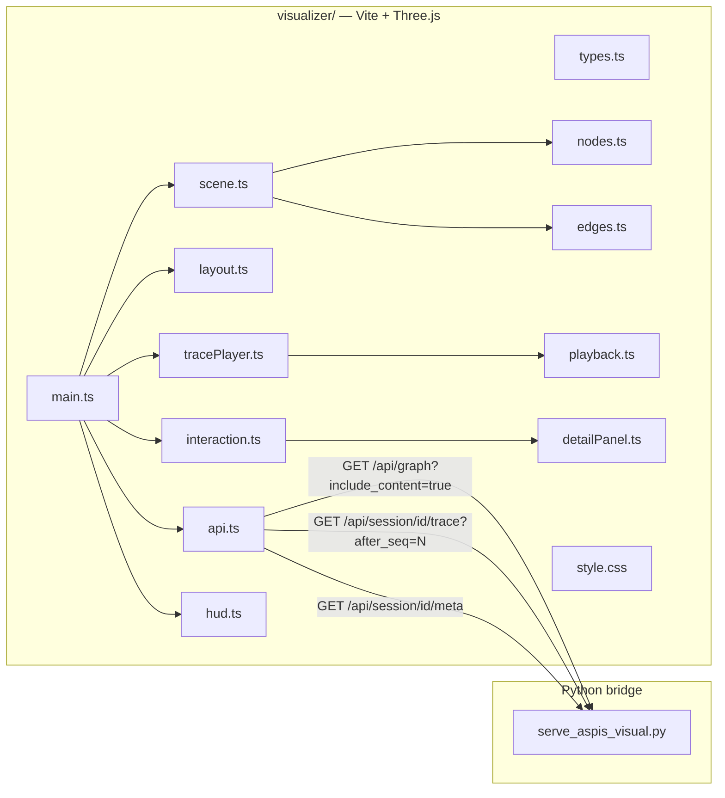

# Three.js ASPIS visualizer v1

## Context

- **Backend (done):** `tools/serve_aspis_visual.py` serves `GET /api/graph` (schema `aspis.registry_graph.v1`: `nodes`, `edges`, `issues`) and `GET /api/session/{session_id}/trace?after_seq=&limit=` (schema `aspis.visual_api.v1`: `events`, `max_seq`, `trace_enabled`). Session meta at `GET /api/session/{id}/meta`. Loopback-only bind + CORS `*`.
- **Backend gap (v1 prerequisite):** The HTTP bridge currently hardcodes `include_content=False` on `/api/graph`. The CLI supports `--include-content`. The visualizer needs clause content for click-to-expand. **Action:** add `include_content` query param support to the HTTP bridge and register the contract change.
- **Repo:** Greenfield frontend in `visualizer/`. No `package.json` exists today.
- **Scale:** ~63 nodes / ~213 edges. Single-threaded d3-force layout is sufficient; no web worker needed.
- **Graph topology (measured):**
  - **Kinds:** 44 contract, 12 route, 5 guidance, 2 information
  - **High in-degree hubs:** `aspis.registry.shape.schema` (22 in), `aspis.tools.session.error-codes` (12 in), `aspis.tools.session.commands` (11 in)
  - **High out-degree hubs:** `aspis.clause.kind.schema` (11 out), `aspis.tools.session` (11 out)
  - **Root nodes** (0 in-edges): 7 nodes including `aspis.entry`
  - **All nodes have at least 1 outgoing edge** (0 leaf nodes by out-degree)
  - Many bidirectional edge pairs exist (e.g. `aspis.entry` ↔ `aspis.clause.section`)
- **Trace event shape** (from `trace.jsonl`):

```json
  {
    "ts": "2026-03-20T03:28:21Z",
    "seq": 1,
    "cmd": "path:aspis.entry",
    "elapsed_ms": 0,
    "response_summary": {
      "status": "ok",
      "clauses_resolved": ["aspis.entry"],
      "paths_returned": ["aspis.authority.surface.schema", "..."],
      "blocking": false
    },
    "paths_by_id": {
      "aspis.entry": ["aspis.authority.surface.schema", "aspis.authority.selection.schema", "..."]
    }
  }
  

```

## Architecture




## Backend prerequisite

### `include_content` support on `/api/graph`

The governance contract `aspis.tools.session.visual-http` states the HTTP bridge calls `build_registry_graph_document(docs_root)` with `include_content=False` only. For the click-to-expand feature:

- Add query param `include_content` (boolean, default `false`) to `GET /api/graph` in `serve_aspis_visual.py`.
- When `include_content=true`, pass `include_content=True` to `build_registry_graph_document()`.
- Update the governance clause `aspis.tools.session.visual-http` registry_slots to document this param.
- At ~63 nodes, including content adds minimal payload size — acceptable for a single fetch at startup.

**Alternative considered and rejected:** A separate `GET /api/clause/{id}` endpoint would work but adds latency on every click and complexity for no benefit at this scale.

## Data layer

### Types (`src/types.ts`)

```typescript
interface ClauseNode {
  id: string;
  meta: boolean;
  kind: 'contract' | 'route' | 'guidance' | 'information';
  status: string;
  owner_doc: string;
  paths: string[];
  content?: string;
  keywords?: string[];
  registry_slots?: Record<string, string>;
}

interface GraphEdge {
  from: string;
  to: string;
}

interface GraphResponse {
  schema_version: string;   // "aspis.registry_graph.v1"
  docs_root: string;
  nodes: ClauseNode[];
  edges: GraphEdge[];
  issues: Array<{ code: string; message: string }>;
}

interface TraceEvent {
  ts: string;
  seq: number;
  cmd: string;
  elapsed_ms: number;
  response_summary: {
    status: string;
    clauses_resolved: string[];
    paths_returned: string[];
    blocking: boolean;
  };
  paths_by_id: Record<string, string[]>;
  context?: Record<string, unknown>;
}

interface TraceResponse {
  schema_version: string;   // "aspis.visual_api.v1"
  trace_enabled: boolean;
  events: TraceEvent[];
  max_seq: number;
}

interface SessionMeta {
  schema_version: string;
  session_id: string;
  name: string;
  lifecycle: string;
  started_at: string;
  ended_at: string | null;
  command_count: number;
  next_seq: number;
  trace_enabled: boolean;
  trace_full_default: boolean;
  surface_kind: string | null;
  namespace: string | null;
  clauses_touched_count: number;
}
```

### API client (`src/api.ts`)

- `fetchGraph(includeContent?: boolean): Promise<GraphResponse>` — single call at startup with `include_content=true`.
- `fetchSessionMeta(sessionId: string): Promise<SessionMeta>` — called once per session to validate and display meta.
- `pollTrace(sessionId: string, afterSeq: number, limit?: number): Promise<TraceResponse>` — called repeatedly per session.
- Base URL from `VITE_ASPIS_API_BASE` (default `http://127.0.0.1:8765`).
- **Workspace query params:** All API calls append optional `config`, `design_docs_dir`, `governance_doc` query params when present. These are sourced from the page URL's own query string (e.g. `?config=aspis.yaml&governance_doc=...`) and forwarded to the backend on every request. This mirrors the CLI workspace flags and enables deep-linking to specific workspace configurations. Internally, `api.ts` reads these once at init from `window.location.search` and appends them to every fetch URL.
- Error handling: parse JSON error envelope `{status: "error", issues: [...]}` and surface in HUD.

## Layout (`src/layout.ts`)

### Namespace-clustered force simulation

Rather than a flat force layout that scatters related clauses randomly, group nodes by namespace prefix:


| Cluster            | Prefix match                                        | Example nodes                                                             |
| ------------------ | --------------------------------------------------- | ------------------------------------------------------------------------- |
| Entry/Authority    | `aspis.entry`, `aspis.authority.`*, `aspis.domains` | `aspis.entry`, `aspis.authority.surface.schema`                           |
| Registration       | `aspis.registration.`*                              | `aspis.registration.protocol`, `aspis.registration.default-target.policy` |
| Clause             | `aspis.clause.`*                                    | `aspis.clause.schema`, `aspis.clause.kind.schema`, `aspis.clause.section` |
| Registry           | `aspis.registry.`*                                  | `aspis.registry.shape.schema`, `aspis.registry.slots.schema`              |
| Workspace/Instance | `aspis.workspace.`*, `aspis.instance.`*             | `aspis.workspace.manifest.schema`                                         |
| Tools/Session      | `aspis.tools.*`                                     | `aspis.tools.session`, `aspis.tools.session.commands`                     |


**Implementation:**

- Assign each node a `group: number` using an ordered rule cascade:
  1. **Explicit table match:** Check the node's `id` against the cluster table rows using `startsWith` (e.g. `aspis.tools.`*) or exact ID match (e.g. `aspis.entry`, `aspis.domains`). First matching row wins.
  2. **Fallback prefix rule:** For IDs not matched by any table row, extract the first two dotted segments after `aspis.` (e.g. `aspis.foo.bar.baz` → `foo.bar`). IDs with only one segment after `aspis.` (e.g. `aspis.entry`) use that single segment as the prefix key.
  3. **Ungrouped fallback:** Nodes matching no rule get a default group centered at origin.
- Use d3 forces: `forceLink` (edge attraction), `forceManyBody` (repulsion), `forceCenter`, and a **custom cluster force function** (not the `d3-force-cluster` npm package — a simple hand-rolled force that nudges each node toward its group's running centroid with strength ~0.3 per tick, implemented as a standard d3-force-compatible function). This keeps clusters organic without rigid positions and avoids an extra dependency.
- Run simulation for ~300 ticks (sufficient for convergence at 63 nodes).
- Map resulting `(x, y)` → Three.js `(x, 0, z)` with Y as up-axis.

### Entry node positioning

`aspis.entry` is the canonical starting node for every agent crawl. Pin it (or bias it) toward the left/center of the layout so crawl animations naturally read left-to-right.

## Scene (`src/scene.ts`)

- `THREE.Scene` with background `#0a0c0f`.
- Subtle `THREE.Fog` (same color, near=50, far=200) for depth fade on peripheral nodes.
- `PerspectiveCamera` on +Y axis, looking down at graph center. Initial height auto-calculated from graph bounding box.
- `OrbitControls` with:
  - `minPolarAngle`: 0 (straight down)
  - `maxPolarAngle`: Math.PI / 3 (60° — allows slight tilt for depth perception)
  - `enableDamping`: true
  - Zoom limits based on graph extent
- `CSS2DRenderer` overlaid on the WebGL canvas for crisp monospace labels.
- Ambient light + subtle directional light from above for mesh shading.
- `requestAnimationFrame` render loop driving both renderers.

## Nodes (`src/nodes.ts`)

### Kind-differentiated geometry

Each clause `kind` gets a distinct geometry so the graph communicates structure at a glance:


| Kind          | Geometry                        | Base color        | Rationale                             |
| ------------- | ------------------------------- | ----------------- | ------------------------------------- |
| `contract`    | `SphereGeometry` (r=0.4)        | Cyan `#00e5ff`    | Most common (44 nodes), neutral shape |
| `route`       | `OctahedronGeometry` (r=0.5)    | Magenta `#ff00e5` | Directional/navigational feel         |
| `guidance`    | `DodecahedronGeometry` (r=0.45) | Amber `#ffab00`   | Advisory/soft                         |
| `information` | `BoxGeometry` (0.6)             | White `#e0e0e0`   | Data/static feel                      |


**Material:** `MeshStandardMaterial` with low emissive intensity at rest. Visited nodes get elevated `emissiveIntensity`. Active (currently-being-resolved) nodes get a brief scale pulse via tween.

### `aspis.entry` glow ring

A `THREE.RingGeometry` or `TorusGeometry` with animated emissive pulse around `aspis.entry` to mark it as the universal starting point. Distinct from visited-node styling.

### CSS2D labels

Each node gets a `CSS2DObject` positioned slightly above the mesh, containing a `<span>` with the clause `id` in monospace. **Label truncation rule:** strip the `aspis.` prefix, then show the last two dot-separated segments if two or more segments remain, otherwise show the remaining segment(s) as-is. Examples: `aspis.entry` → `entry`, `aspis.authority.surface.schema` → `surface.schema`, `aspis.tools.session.commands` → `session.commands`. Full ID shown on hover via tooltip. Labels fade at distance via CSS opacity transition keyed to camera distance (computed in render loop or via `CSS2DRenderer` distance callback).

## Edges (`src/edges.ts`)

### Directed edge rendering

Edges must communicate direction — this is a directed graph and crawl direction is the entire point of the visualization.

**Line geometry:** `THREE.Line2` (from `three/examples/jsm/lines/`) for variable-width lines with per-vertex color, or `THREE.BufferGeometry` + `LineSegments` for performance.

**Arrow indicators:** Small `THREE.ConeGeometry` (height=0.3, radius=0.12) placed at 85% of the way along each edge, oriented along the edge direction vector. Same color as the edge line. Arrows are the primary directional cue.

**Bidirectional edge handling:** When edges exist in both directions between the same pair (A→B and B→A), offset each edge slightly perpendicular to the line between the nodes (±0.15 units) so both arrows are visible. Detect bidirectional pairs during graph build.

**Base styling:**

- Dim color at rest (e.g. `#1a3a4a` at opacity 0.3)
- Brighter on hover (opacity 0.8)
- Trail color when part of a session's visited path

**High-degree hub handling:** For nodes like `aspis.registry.shape.schema` (22 incoming edges), edges approaching the node fan out slightly in a radial pattern rather than overlapping. This is handled naturally by the force layout positioning but may need a small angular offset at the target end for readability.

### Edge index

Build a `Map<string, EdgeObject>` keyed by `${from}→${to}` for O(1) lookup when trace events arrive. Each entry references the Three.js line object and arrow mesh for that edge, enabling instant highlight/pulse without scene traversal.

## Interaction (`src/interaction.ts`)

### Raycaster setup

- `THREE.Raycaster` updated on `pointermove` and `click` events.
- **Node picking:** Raycast against node meshes directly.
- **Edge picking:** Edges (lines) are too thin for reliable GPU raycasting. Use a **screen-space distance test** instead: on `pointermove`, project each edge's arrow cone position to screen coordinates and test if the pointer is within 12px. Only test edges within the camera frustum. This keeps the per-frame cost low (~200 distance tests at current scale) while providing reliable edge hover/click.
- `pointermove` → hover state; `click` → selection state.
- CSS cursor changes: `pointer` on hoverable nodes/edges, `default` elsewhere.

### Hover behavior

When pointer hovers over a node:

1. Highlight the node mesh (boost emissive).
2. Highlight all **outgoing** edges from that node (the `paths` connections) in cyan.
3. Highlight all **incoming** edges to that node in a dimmer shade.
4. Show a tooltip with `id`, `kind`, and `paths.length` count.

This "path preview" lets users explore where an agent *would* go from any clause, even without a live session.

### Click behavior

Click on a node → open the **detail panel** (`src/detailPanel.ts`). Click on empty space or press Escape → close detail panel. Only one detail panel open at a time.

### Edge interaction

Hovering near an edge arrow shows a small tooltip with `from → to`. During animation, clicking a pulsing edge opens the trace event that triggered it in the event log.

## Detail panel (`src/detailPanel.ts`)

A slide-out panel (right side, ~350px wide) rendered as DOM overlay (not world-space):

**Header:**

- Clause ID as title
- Kind badge (colored chip matching node geometry color)
- Status badge
- `meta` indicator

**Body:**

- **Content section:** Clause markdown content rendered as HTML (use a lightweight markdown renderer like `marked` or `snarkdown` — no heavy deps). Scrollable.
- **Paths section:** List of `paths` entries as clickable links. Clicking a path ID:
  1. Closes the current detail panel
  2. Flies the camera to the target node (smooth tween)
  3. Opens the target node's detail panel
  This creates a **navigable graph** — users can follow the same path an agent would.
- **Registry slots:** If present, rendered as key-value pairs in a `<dl>` or table.
- **Keywords:** If present, rendered as tags.

**Styling:** Same cyberpunk terminal aesthetic — dark bg, monospace, cyan borders, subtle glow.

## Multi-session trace animation (`src/tracePlayer.ts`)

### Multi-agent support

The visualizer supports **N concurrent sessions**, each representing a different agent crawling the ASPIS.

**Session input:** URL query params `?session=id1&session=id2` and/or a HUD input where users can add/remove session IDs. Each session is assigned a color from a rotating palette:


| Session index | Trail color       | Label      |
| ------------- | ----------------- | ---------- |
| 0             | Cyan `#00e5ff`    | Agent A    |
| 1             | Magenta `#ff00e5` | Agent B    |
| 2             | Amber `#ffab00`   | Agent C    |
| 3             | Lime `#76ff03`    | Agent D    |
| 4+            | Cycle palette     | Agent E... |


### Per-session state

```typescript
interface SessionTraceState {
  sessionId: string;
  color: THREE.Color;
  label: string;
  lastSeq: number;
  visitedNodes: Set<string>;
  visitedEdges: Set<string>;  // "from→to" keys
  events: TraceEvent[];       // all received events for replay
  pollInterval: ReturnType<typeof setInterval> | null;
  meta: SessionMeta | null;
}
```

### Poll loop

Each session runs an independent poll loop:

1. Fetch `GET /api/session/{id}/meta` once at registration to validate session exists and check `trace_enabled`.
2. If `trace_enabled === false`, show warning in HUD, no poll.
3. Poll `GET /api/session/{id}/trace?after_seq={lastSeq}&limit=100` every 500ms (configurable via playback speed).
4. For each new event:
  - Extract `paths_by_id` entries.
  - For each `from_id → [to_id, ...]`:
    - Look up edge in edge index.
    - **Pulse** the edge: tween edge color from dim → session trail color → dim over 600ms.
    - **Packet animation:** spawn a small emissive sphere at the `from` node, lerp it along the edge curve to the `to` node over 400ms, then despawn. Stagger multiple targets by 100ms each.
    - Add `from_id` and all `to_id` values to the session's `visitedNodes` set.
    - Add each `from→to` to `visitedEdges`.
  - Visited nodes get a persistent colored ring (thin torus) in the session's color.
  - Visited edges get a persistent tint shift toward the session color (blended if multiple sessions visited the same edge).
5. Update `lastSeq`: when the batch is non-empty, set `lastSeq = Math.max(...events.map(e => e.seq))` (the highest seq in the *returned batch*, not the response's `max_seq`). When the batch is empty, keep `lastSeq` unchanged. The response's `max_seq` is the global maximum across the entire trace file and must only be used for UI metadata (e.g. progress indicator, "N events total") — **not** as the poll cursor, because a capped batch (`limit` < total remaining) would cause the cursor to skip undelivered events.

### Handling session lifecycle

- **Ended session drain:** When `lifecycle === "ended"` (from meta or inferred), continue polling until a poll returns `events: []` (no new events remaining). Then stop polling for that session and show "Session ended" in HUD. This avoids premature stop when the session has just ended but events haven't been fully consumed.
- **Ended + exhausted:** Specifically, stop when `lifecycle === "ended"` AND `events.length === 0` on a poll response. Optionally also check `pollAfterSeq >= max_seq` as a secondary confirmation.
- If the poll returns an error (session not found, config mismatch), show error in HUD and stop polling immediately.

## Playback controls (`src/playback.ts`)

Controls for temporal navigation through trace data. Applies globally across all active sessions.

### State model: poll cursor vs playback cursor

The system maintains **two independent cursor types** to avoid conflation:

1. `**pollAfterSeq`** (per-session, monotonic): The HTTP poll cursor. Only advances forward during live polling. Set from `Math.max(...events.map(e => e.seq))` on each non-empty batch. Never reset to 0 — even during replay, polling is suspended rather than re-fetched.
2. `**virtualPlaybackIndex`** (global, non-monotonic): The position in the merged virtual timeline. Can jump forward, backward, or reset to 0 for replay/scrub.

**Mode transitions:**


| Action      | `pollAfterSeq`                                                               | `virtualPlaybackIndex`       | Polling                                    |
| ----------- | ---------------------------------------------------------------------------- | ---------------------------- | ------------------------------------------ |
| Live play   | Advances per batch                                                           | Advances with each new event | Active                                     |
| Pause       | Frozen                                                                       | Frozen                       | Suspended                                  |
| Step        | Frozen                                                                       | +1 (from stored events)      | Suspended                                  |
| Replay      | Frozen (unchanged)                                                           | Reset to 0                   | Suspended; resumes at end of stored events |
| Scrub to N  | Set to `max(seq)` per session in events `[0..N]` inclusive (after N applied) | Set to N                     | Suspended; resumes from N+1 if playing     |
| Resume live | Uses current `pollAfterSeq`                                                  | Continues from current       | Active                                     |


On **scrub/replay resume to live**: each session's `pollAfterSeq` is recomputed as the max `seq` of that session's events within the applied merged range `[0..N]`. This ensures the next poll fetches only events the session hasn't yet consumed, with no duplicate re-fetch of the full history.

### Merged virtual timeline

Since each session has its own independent `seq` counter, the playback system operates on a **merged virtual timeline** rather than raw `seq` values. At init and whenever new events arrive:

1. Collect all stored events from all sessions into a single array, tagging each with its `sessionId`.
2. Sort by `(ts, sessionId, seq)` — timestamp is the primary ordering key, with sessionId and seq as tiebreakers.
3. Assign each event a **virtual index** (0-based position in the merged array).
4. The timeline scrub bar maps to this virtual index range `[0, mergedEvents.length - 1]`.

This means "step forward" advances to the next event globally (which may be from any session). Scrubbing to position N instantly re-applies events at merged indices `[0..N-1]` (updating visited state without animation), then animates event N. After the scrub, `virtualPlaybackIndex` equals N and represents "state through event N inclusive."

**Controls:**

- **Play / Pause** — toggle live polling on all sessions. When paused, no new events are fetched and polling is suspended.
- **Step forward** — when paused, advance exactly one event in the merged virtual timeline (the next event by `ts` across all sessions). The corresponding session's trail updates. Polling remains suspended.
- **Speed** — multiplier applied to both poll interval and animation durations: 0.5x, 1x (default), 2x, 4x. During replay, inter-event delays are derived from `ts` deltas scaled by this multiplier.
- **Replay** — suspend polling, clear all visited sets, reset `virtualPlaybackIndex` to 0, and replay from the beginning using stored events with timing derived from `ts` deltas. `pollAfterSeq` is NOT reset. When replay reaches the end of stored events and play is active, resume live polling using each session's existing `pollAfterSeq`.
- **Timeline scrub** — a thin horizontal bar spanning the full merged virtual index range. Dragging the scrub head to position N: (1) suspends polling, (2) clears all visited sets, (3) instantly re-applies events `[0..N-1]` (updates visited nodes/edges, no animation), (4) animates event N, (5) recomputes each session's effective `pollAfterSeq` as the max `seq` for that session over events `[0..N]` inclusive (i.e. after N is applied, so N's own seq is included — prevents re-fetch on resume), (6) resumes polling from recomputed cursors if playing.

**Implementation:** Playback state is centralized in a `PlaybackController` class. `tracePlayer.ts` checks playback state before dispatching animations. During replay, events are fed from the merged stored array rather than live polling. The merged timeline is rebuilt whenever a new event arrives from any session (append + re-sort is O(n log n) but n is small — typically < 500 events per session).

## HUD panels (`src/hud.ts`)

Fixed-position DOM overlays. All panels use the cyberpunk terminal aesthetic.

### Top-left: Graph stats

- `docs_root` path
- Node count / edge count
- Kind breakdown (e.g. "44 contract · 12 route · 5 guidance · 2 info")
- **Coverage %** per session: `visitedNodes.size / totalNodes * 100`

### Top-right: Session manager

- Input field for adding session IDs (32-char hex, validated client-side with same regex as backend)
- List of active sessions with color dot, label, session ID (truncated), status (polling/paused/ended/error)
- Remove button per session
- "Add from URL" option (reads `?session=` params on load)

### Bottom-left: Issues panel

- List of `issues` from the graph response (parse problems from registry indexing)
- Each issue shows `code` and `message`
- Collapsible; hidden if no issues

### Bottom-center: Playback bar

- Play/Pause button, step button, speed selector, replay button
- Timeline scrub bar spanning full width

### Bottom-right: Trace event log

- Scrollable terminal-style log, newest at bottom
- Each entry: `[seq] [session_label] cmd → resolved_clauses (elapsed_ms ms)`
- Color-coded by session
- Clicking an entry flashes the corresponding edges in the scene and scrolls the graph to center on the resolved clauses

### Legend (toggleable)

- Node shape + color legend for clause kinds
- Session trail color legend (dynamic, updates as sessions are added)

## Theme / styling (`src/style.css`)

- **Background:** `#0a0c0f` (near-black)
- **Font stack:** `'JetBrains Mono', 'IBM Plex Mono', 'Fira Code', monospace`
- **Accent palette:** Cyan `#00e5ff`, Magenta `#ff00e5`, Amber `#ffab00`, Lime `#76ff03`
- **Panel styling:** `background: rgba(10, 12, 15, 0.9)`, `border: 1px solid rgba(0, 229, 255, 0.2)`, `backdrop-filter: blur(8px)`
- **Scanline overlay:** CSS `::after` pseudo-element on body with repeating linear gradient (2px transparent / 1px rgba(0,229,255,0.03)) for CRT effect. `pointer-events: none`.
- **Scrollbars:** Styled thin, cyan track on dark bg.
- **Text glow:** Subtle `text-shadow: 0 0 4px currentColor` on accent-colored text.
- **Responsive:** Panels collapse to icons on viewports < 768px. Scene fills viewport.

## Key files


| Area        | Files                                                                      |
| ----------- | -------------------------------------------------------------------------- |
| Backend     | `tools/serve_aspis_visual.py` (add `include_content` query param)          |
| Scaffold    | `visualizer/package.json`, `vite.config.ts`, `tsconfig.json`, `index.html` |
| App         | `src/main.ts`, `src/style.css`                                             |
| Data        | `src/types.ts`, `src/api.ts`                                               |
| Layout      | `src/layout.ts`                                                            |
| Scene       | `src/scene.ts`, `src/nodes.ts`, `src/edges.ts`                             |
| Interaction | `src/interaction.ts`, `src/detailPanel.ts`                                 |
| Animation   | `src/tracePlayer.ts`, `src/playback.ts`                                    |
| UI          | `src/hud.ts`                                                               |
| Docs        | `visualizer/README.md`                                                     |


## Dependencies


| Package                 | Purpose                                                                                                                          | Approximate size |
| ----------------------- | -------------------------------------------------------------------------------------------------------------------------------- | ---------------- |
| `three`                 | 3D rendering + examples (CSS2DRenderer, Line2, OrbitControls via `three/examples/jsm/...` subpaths — no separate package needed) | ~150KB gzipped   |
| `d3-force`              | Force-directed layout                                                                                                            | ~15KB            |
| `marked` or `snarkdown` | Markdown → HTML for clause content                                                                                               | ~7KB / ~1KB      |
| `@tweenjs/tween.js`     | Smooth animations (camera fly, pulses)                                                                                           | ~5KB             |


No framework (React, Vue, etc.) — vanilla TypeScript with DOM manipulation. Keeps bundle small and avoids abstraction overhead for a single-page visualization.

## Dev workflow

- **Terminal 1:** `python3 tools/serve_aspis_visual.py --config aspis.yaml`
- **Terminal 2:** `cd visualizer && npm run dev`
- **Terminal 3 (optional):** Run a traced ASPIS session — `python3 tools/aspis.py session:start --name demo --trace` then `session:cmd` calls — and paste the session ID into the visualizer.
- Vite fetches directly from `127.0.0.1:8765` (CORS already allows it). No proxy needed.

## Out of scope for v1

- **WebSocket / SSE** — polling is sufficient per backend contract.
- `**/api/sessions` listing** — not implemented server-side; session ID is manual input.
- **Graph editing / DOT import / VR** — read-only visualization.
- **Post-processing effects** (bloom, glitch) — CSS scanline is enough for v1; GPU post-processing is a v2 enhancement.
- **Persistent layout** — layout is computed fresh each load; saving/loading positions is v2.

## Governance updates (required for agent discoverability)

For the visualizer to be useful, agents must be able to discover — through normal ASPIS crawl discipline — how to start traced sessions and that a visual client exists. The governance doc also needs contract updates to match the implementation changes (backend `include_content` support).

### Summary of all governance changes


| #   | Clause                              | Change type                  | What changes                                                                               |
| --- | ----------------------------------- | ---------------------------- | ------------------------------------------------------------------------------------------ |
| 1   | `aspis.entry`                       | **Paths mutation**           | Add `aspis.cli.help` to `paths`                                                            |
| 2   | `aspis.cli.help`                    | **Content + paths mutation** | Add visual tracking workflow paragraph; add `aspis.tools.session.visual-client` to `paths` |
| 3   | `aspis.tools.session`               | **Paths mutation**           | Add `aspis.tools.session.visual-client` to `paths`                                         |
| 4   | `aspis.tools.session.visual-http`   | **Registry slots mutation**  | Replace prohibition of `include_content` with documentation of the new query param         |
| 5   | `aspis.tools.session.visual-client` | **New clause registration**  | Full contract for the Three.js visualizer client                                           |


### 1. Add `aspis.cli.help` to `aspis.entry` paths

Currently `aspis.entry` mentions `aspis.cli.help` in its content prose but does **not** include it as a formal `paths` entry. An agent following crawl discipline (resolving `paths` edges) will never discover session tracing or visual tooling from the entry point.

**Change in `ASPIS/0.00 - Governance: Origin.md`:** Add `aspis.cli.help` to the `paths:` list in the `aspis.entry` clause YAML frontmatter.

**Resulting path chain:** `aspis.entry` → `aspis.cli.help` → `aspis.tools.session.commands` → `aspis.tools.session` → `aspis.tools.session.visual-client`

### 2. Update `aspis.cli.help` content and paths

`aspis.cli.help` already mentions `session:start`, `session:cmd`, `session:end`, and has `aspis.tools.session.commands` and `aspis.tools.session.visual-graph` in its `paths`. Two changes:

**Content addition:** Append a "Visual tracking" paragraph:

> **Visual tracking:** To make a session visible in the ASPIS visualizer, start it with `--trace`: `python3 tools/aspis.py session:start --name <label> --trace`. The returned `session_id` (32-char hex) can be pasted into the visualizer UI or passed via URL query `?session=<id>`. The visualizer polls the HTTP bridge (`python3 tools/serve_aspis_visual.py`) for trace events and animates the agent's crawl path in real time. Multiple sessions can be tracked simultaneously with distinct visual trails. See `aspis.tools.session.visual-client` for the visualizer's full contract.

**Paths addition:** Add `aspis.tools.session.visual-client` to the `paths:` list so the visual client is reachable from the CLI help contract.

### 3. Add `aspis.tools.session.visual-client` to `aspis.tools.session` paths

The `aspis.tools.session` hub route currently has paths to `visual-graph` and `visual-http` (the backend tooling) but NOT the frontend visualizer. An agent crawling through the session tooling hub would discover the backend contracts but never the client.

**Change:** Add `aspis.tools.session.visual-client` to the `paths:` list in the `aspis.tools.session` clause.

### 4. Mutate `aspis.tools.session.visual-http` registry_slots

The current `registry_slots.required` explicitly states: *"`GET /api/graph` calls `build_registry_graph_document(docs_root)` with default `include_content=False` only (no HTTP or query switch for clause body content)"*.

This is a **contract mutation**, not an append — the prohibition text must be replaced.

**Change:** Replace the `include_content=False` only clause with:

> `GET /api/graph` calls `build_registry_graph_document(docs_root)`; accepts optional query param `include_content` (boolean string, default `false`); when `true`, retains per-clause `content` field in node payloads (equivalent to `visual:graph --include-content`); when `false` or absent, strips `content` from nodes.

All other `registry_slots.required` text remains unchanged.

### 5. Register `aspis.tools.session.visual-client` clause (new)

Full clause definition to be added to `ASPIS/0.00 - Governance: Origin.md`:

```yaml
id: aspis.tools.session.visual-client
meta: true
kind: contract
status: active
owner_doc: aspis.doc.governance.origin
paths:
  - aspis.tools.session.commands
  - aspis.tools.session.visual-http
  - aspis.tools.session.visual-graph
  - aspis.tools.workspace
```

**Content:**

> Browser-based Three.js visualizer for ASPIS registry graphs and session trace animation.
>
> Renders the full registry clause graph as an interactive, namespace-clustered force-directed layout with directed edges and kind-differentiated node shapes. Clicking a clause node expands its full content, paths, and metadata in a detail panel. Paths within the detail panel are navigable links — clicking one flies the camera to the target clause, mirroring agent crawl behavior.
>
> Supports real-time animation of one or more concurrent traced sessions. Each session's crawl path is animated with directed edge pulses and packet motion, color-coded per session. Visited clauses and edges accumulate persistent trail styling. Playback controls (play, pause, step, speed, replay, timeline scrub) enable temporal navigation through trace histories.
>
> Requires the HTTP bridge (`aspis.tools.session.visual-http`) to be running. Sessions must be started with `--trace` for visual tracking.

**Registry slots:**

```yaml
registry_slots:
  required: >
    `visualizer/` directory as implementation root;
    env `VITE_ASPIS_API_BASE` (default `http://127.0.0.1:8765`);
    URL query param `session` (repeatable, 32-char lowercase hex session_id);
    workspace URL query params `config`, `design_docs_dir`, `governance_doc` forwarded to backend on all API calls;
    consumes `aspis.registry_graph.v1` schema from `GET /api/graph?include_content=true`;
    consumes `aspis.visual_api.v1` schema from `GET /api/session/{id}/trace` and `GET /api/session/{id}/meta`;
    poll cursor advances by batch max `seq` (not response `max_seq`);
    multi-session support with per-session poll loops and distinct trail colors
  verification_artifacts: >
    `visualizer/package.json`, `visualizer/src/main.ts`,
    `visualizer/src/api.ts`, `visualizer/src/tracePlayer.ts`
```

### Verification: agent crawl path after all changes

An agent starting from `aspis.entry` can now reach the visualizer through formal `paths` edges:

```
aspis.entry
  → aspis.cli.help (NEW edge)
    → aspis.tools.session.commands
      → aspis.tools.session.visual-graph
      → aspis.tools.session (via other paths)
        → aspis.tools.session.visual-client (NEW edge)
          → aspis.tools.session.visual-http
    → aspis.tools.session.visual-client (NEW edge, direct from cli.help)
```

The agent can also reach the visualizer directly from the session hub:

```
aspis.tools.session
  → aspis.tools.session.visual-client (NEW edge)
```

At each step, the clause content describes behavior without requiring code inspection.

## Success criteria

1. **Static graph:** Opening the Vite app shows the full registry graph from above with readable labels, directed arrows, kind-differentiated node shapes, and namespace clustering.
2. **Click-to-expand:** Clicking any clause node opens a detail panel showing its full content, paths (as navigable links), and metadata.
3. **Live multi-agent animation:** With one or more traced session IDs, new trace events produce visible directed motion along edges with per-session color coding and persistent visited trails.
4. **Playback:** Users can pause, step, adjust speed, and replay session traces.
5. **Coverage tracking:** HUD shows per-session coverage percentage and cumulative trace event log.
6. **Issues surfacing:** Registry parse issues from the graph JSON appear in the HUD panel.
7. **Path preview:** Hovering any node highlights its outgoing paths, showing where an agent would navigate next.

