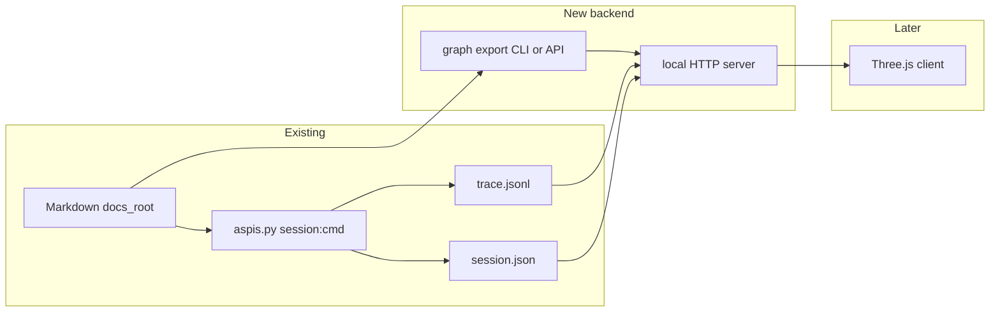

# Python backend for ASPIS session visualizer

## What already works (no change required for MVP)

Session tracing already produces everything a visualizer needs for **the agent’s path**:

- **[tools/aspis.py](tools/aspis.py)** — Each `session:cmd` with `--trace` appends one JSON object to `trace.jsonl` with `seq`, `ts`, `cmd`, `elapsed_ms`, `response_summary`, **`paths_by_id`** (directed edges from requested clause → each `paths` entry), and `context` (see `_handle_session_cmd` in that file ~913–928).
- **`session.json`** — Authority snapshot, `lifecycle`, `command_count`, `next_seq`, `clauses_touched_success` (durable even without trace).
- **Graph aggregation** — `_graphviz_dot_from_trace_file` in `aspis.py` already walks `trace.jsonl` and merges edges from `paths_by_id`; the same logic can power a JSON edge list for the frontend.

**Gap:** the trace only covers **visited** clauses. A “full graph underlay” needs a **second data source**: the in-memory registry index from markdown ([`load_registry_index`](tools/clause.py) / `_index_clauses`), which is not exposed as a single JSON artifact today.




## Backend deliverables (ordered)

### 1. Registry graph export (static underlay)

**Goal:** One deterministic JSON document: all clause ids as nodes, and directed edges `clause_id → path_id` for every registered `paths:` entry (same semantics as visualization from `paths_by_id`, but for the **entire** index).

**Implementation sketch:**

- Add a **new top-level CLI subcommand** in [tools/aspis.py](tools/aspis.py) `main()` (same dispatch style as `session:start`), e.g. `visual:graph` or `export:clause-graph` (name to taste), parsed **before** clause mode.
- Reuse the same workspace resolution path as `_handle_clause` / session commands (`_resolve_clause_runtime_paths_with_manifest` + `docs_root`).
- Call `clause.load_registry_index(docs_root)` and iterate `by_id`: for each clause, read `paths` (list of strings). Emit JSON such as:
  - `schema_version`
  - `docs_root` (absolute, normalized)
  - `nodes`: `[{ "id", "kind", "meta", "status", ... }]` — reuse or mirror `_public_clause_payload` in [tools/clause.py](tools/clause.py) fields the UI needs for labels (keep payload bounded; omit huge `content` by default, optional `--include-content` if you want prose previews later).
  - `edges`: `[{ "from", "to" }]` — one edge per path string; optionally include edges to targets **not** present in `nodes` so broken/missing ids still appear as dangling targets.
- **Lint issues:** include `issues` from the index in the JSON (or a separate field) so the UI can show parse problems without failing the export.

**Tests:** extend or mirror [tools/test_session_tracing.py](tools/test_session_tracing.py) style — subprocess run the new command against the repo’s `aspis.yaml`, assert JSON shape and that known clauses (e.g. `aspis.entry`) have non-empty `paths` edges.

### 2. Shared session-store helpers (refactor)

**Goal:** The HTTP server must **locate and read** `session_dir` / `session.json` / `trace.jsonl` the same way the CLI does, without copying `_locate_session_dir`, `_session_paths_match`, and path normalization from [tools/aspis.py](tools/aspis.py).

**Approach:**

- Move **session path resolution + validation** into a small module, e.g. [tools/session_store.py](tools/session_store.py) (or add cohesive functions to [tools/workspace.py](tools/workspace.py) if you prefer fewer files):
  - `session_directory` already lives in workspace; keep using it.
  - Move or wrap: manifest-wide session search (`_candidate_session_dirs` / `_locate_session_dir`), comparison of argv-resolved paths vs `session.json` (`_session_paths_match`), and maybe “load session state or error code” return type.
- Update [tools/aspis.py](tools/aspis.py) session handlers to call the shared module so behavior stays identical; run existing [tools/test_session_tracing.py](tools/test_session_tracing.py) unchanged.

This refactor is the main **non-feature** cost; it avoids drift between CLI and server.

### 3. Trace read API helpers (library)

**Goal:** Incremental reads for animation (`after_seq`).

- Add functions (same module as above or `tools/trace_io.py`):
  - `read_trace_lines_since(trace_path: Path, after_seq: int) -> list[dict]` — parse JSONL, filter `seq > after_seq`, sort by `seq`.
  - Optionally `merge_paths_by_id_from_trace(trace_path) -> edges` — extract from `_graphviz_dot_from_trace_file` in `aspis.py` into one place; CLI graphviz and server both call it.

### 4. Local HTTP server (bridge for Three.js)

**Goal:** A long-lived process the frontend can call (e.g. from `npm run aspis-visual` via `python3 tools/...`). **Stdlib-only MVP** is enough: `http.server` + a small handler class or `ThreadingHTTPServer`.

**MVP vs later (endpoint tiering)**


| Tier    | Method | Route                                     | Purpose                                                    |
| ------- | ------ | ----------------------------------------- | ---------------------------------------------------------- |
| **MVP** | GET    | `/health`                                 | Liveness                                                   |
| **MVP** | GET    | `/api/graph?...`                          | Full registry graph (same JSON as graph export CLI)        |
| **MVP** | GET    | `/api/session/{session_id}/meta?...`              | Safe subset of `session.json` for the active/ended session |
| **MVP** | GET    | `/api/session/{session_id}/trace?after_seq=N&...` | Incremental trace events                                   |
| Later   | GET    | `/api/sessions?...`                       | List sessions under `sessions_root` for a picker UI        |


**Browser / CORS (MVP):** A Three.js or Vite dev server on another origin will block cross-origin calls unless CORS is set or traffic is proxied. For MVP, pick one: **(A)** serve the static visualizer from the same Python process (same origin, no CORS), or **(B)** add `Access-Control-Allow-Origin: *` on API responses **only when** the listen address is **strictly loopback** (`127.0.0.1` or `::1`); **do not** use `0.0.0.0` / all interfaces with `*` (LAN exposure + wildcard origin is unsafe). Document the chosen option in the server module docstring so the frontend phase does not guess.

**`session_id` resolution (normative):** Match CLI-generated ids: **32 lowercase hex characters** (`[a-f0-9]{32}`) only; reject any other charset, `..`, slashes, or absolute paths. Resolve the directory **only** via `workspace.session_directory(docs_root, session_id)` after workspace flags resolve `docs_root`; never join user input as a path segment beyond that single id string. If `session.json` is missing under that directory, return **404** with the same error JSON envelope as other API errors.

**HTTP / JSON contract (versioned)**

- **Shared envelope:** All non-health JSON responses include `schema_version` (string, e.g. `"aspis.visual_api.v1"`) at top level where applicable, or document that graph responses use the graph export’s own `schema_version` and API wrappers add `api_schema_version` — **pick one approach in implementation** and keep it stable (record the choice in the server module docstring).
- **Errors:** Non-2xx responses return JSON `{"status":"error","issues":[{"code":"<CODE>","message":"<string>"}]}` aligned with existing CLI error style where practical (reuse reason codes like `SESSION_NOT_FOUND`).
- **`GET /api/graph`:** Response body **identical** to the **§1 registry graph export** (nodes/edges JSON from `load_registry_index`). This is **not** `session:end --format graphviz` (no DOT file, no `dot_path`); graphviz remains a separate CLI concern. Optional HTTP `ETag` / `Cache-Control` from a hash of registry mtimes.
- **`GET /api/session/{session_id}/trace`:** Query: `after_seq` (int, default `0`), optional `limit` (int, default e.g. **100**, max e.g. **1000**) — return at most `limit` events per request, **strictly ascending by `seq`**, only lines where **`seq > after_seq`**. Always **200** on success with `events` (possibly empty): idle polls (`after_seq` ≥ latest `seq` in file) return `events: []` and `max_seq` set to the **last seq in the trace file** or `0` if empty/unreadable. If trace was disabled for the session, return **200** with `events: []` and **`trace_enabled`: false** (normative for MVP). Response: `{"schema_version":"...","events":[...],"max_seq":M}` where each `events` element is a full trace line object as in `trace.jsonl`.
- **Query params for workspace:** Mirror clause mode as query keys: `config`, `design_docs_dir`, `governance_doc` (same semantics as CLI flags).

**Example (illustrative)**

`GET /api/session/7cef328b4f2643d5a837d970e1aed6a0/trace?after_seq=0&limit=100`

```json
{
  "schema_version": "aspis.visual_api.v1",
  "trace_enabled": true,
  "events": [
    {
      "ts": "2026-03-20T02:00:00Z",
      "seq": 1,
      "cmd": "path:aspis.entry",
      "elapsed_ms": 45,
      "response_summary": { "status": "ok", "clauses_resolved": ["aspis.entry"], "paths_returned": ["aspis.authority.surface.schema"], "blocking": false },
      "paths_by_id": { "aspis.entry": ["aspis.authority.surface.schema"] },
      "context": { "namespace": "aspis" }
    }
  ],
  "max_seq": 1
}
```

**Workspace resolution:** Reuse the same entrypoint as the CLI (import shared helpers from `workspace` + `session_store` + manifest load). **Security:** bind `127.0.0.1` only; apply `session_id` rules above.

**Polling vs push:** For “animated session tracking,” **polling `after_seq`** is sufficient for v1 (simple, no WebSocket dependency). Optional phase 2: **SSE** (`text/event-stream`) that blocks until the trace file changes (still stdlib: thread + `time.sleep` loop stat-ing mtime, or `select` on file if you open for read).

### 5. Governance / protocol docs (defer or minimal)

The user asked backend first; **optional** follow-up: register a clause under `aspis.tools.session` (or `aspis.tools.visual`) describing `visual:graph` and the HTTP bridge’s JSON contracts so agents can `path:` to them. Not blocking implementation.

## Out of scope for this backend plan

- Three.js layout, force graph, or `npm` package layout (frontend phase).
- WebSocket / binary protocols unless you explicitly want lower latency than polling.
- Running the HTTP server inside `aspis.py` REPL-style; keep it a **separate entry script** (e.g. [tools/serve_aspis_visual.py](tools/serve_aspis_visual.py)) to avoid complicating the stateless CLI.

## Success criteria

1. `python3 tools/aspis.py <new-graph-command>` prints valid JSON with full node/edge set for a `docs_root`.
2. With an active traced session, repeated `GET .../trace?after_seq=` returns only new lines in `seq` order (`seq > after_seq`), sorted by `seq`, matching the contract in §4.
3. Existing session CLI tests pass after refactor.
4. Server starts with workspace flags, serves graph + trace meta without manual path hacks; **documented** CORS or same-origin strategy; invalid `session_id` rejected without path traversal.

